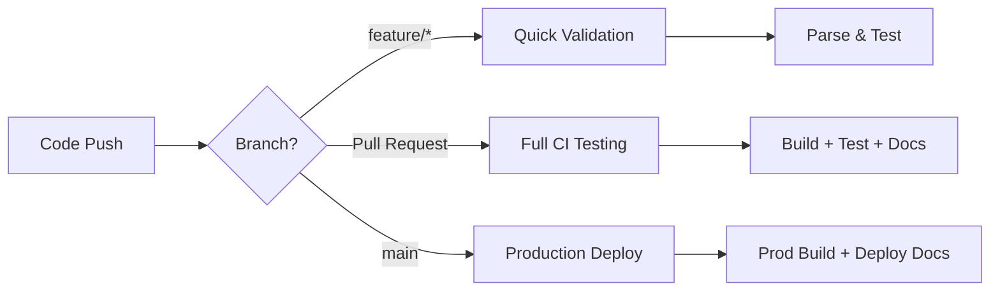

# dbt CI/CD Documentation

## GitHub Actions Workflows

This project includes automated CI/CD pipelines for dbt using GitHub Actions.

### Workflows Overview

#### 1. **dbt CI/CD Pipeline** (`.github/workflows/dbt-ci-cd.yml`)
**Comprehensive pipeline for testing and deployment**

- **Triggers**: PR to main, push to main, manual dispatch
- **PR Testing**: Validates models, runs tests, generates docs
- **Production Deployment**: Builds production models, deploys documentation
- **Artifacts**: Saves dbt outputs and documentation

#### 2. **dbt Quick Validation** (`.github/workflows/dbt-quick-validate.yml`)
**Fast validation for rapid feedback**

- **Triggers**: PR events, manual dispatch  
- **Speed**: Runs parse, compile, and test validation
- **Purpose**: Quick feedback on dbt project health

### CI/CD Process Flow



### What Gets Tested

**On Pull Requests:**
- dbt project parsing
- Model compilation
- All data quality tests (22 tests)
- Documentation generation

**On Production Deploy:**
- Full model build with production data
- Complete test suite validation
- Documentation deployment to GitHub Pages

### 🛠️ Environment Configuration

| Environment | Target | Database Path | Threads |
|------------|--------|---------------|---------|
| Development | `dev` | `data/dev.duckdb` | 1 |
| Production | `prod` | `data/prod.duckdb` | 4 |

### Artifacts & Outputs

**Saved Artifacts:**
- `target/` directory (compiled SQL, docs)
- Production database file
- dbt run results and logs

**Documentation Deployment:**
- Auto-deployed to GitHub Pages at: `https://luinor223.github.io/simple-dbt-pipeline/docs/`

### Monitoring & Alerts

- **Failed Tests**: CI will fail and block PR merging
- **Build Failures**: Deployment stops on any errors  
- **Scheduled Runs**: Optional daily refresh (commented out)

### Local Development

To run the same checks locally:

```bash
# Quick validation
dbt parse --profiles-dir .
dbt test --profiles-dir .

# Full CI simulation  
dbt build --profiles-dir .
dbt docs generate --profiles-dir .

# Production build
dbt build --profiles-dir . --target prod
```
